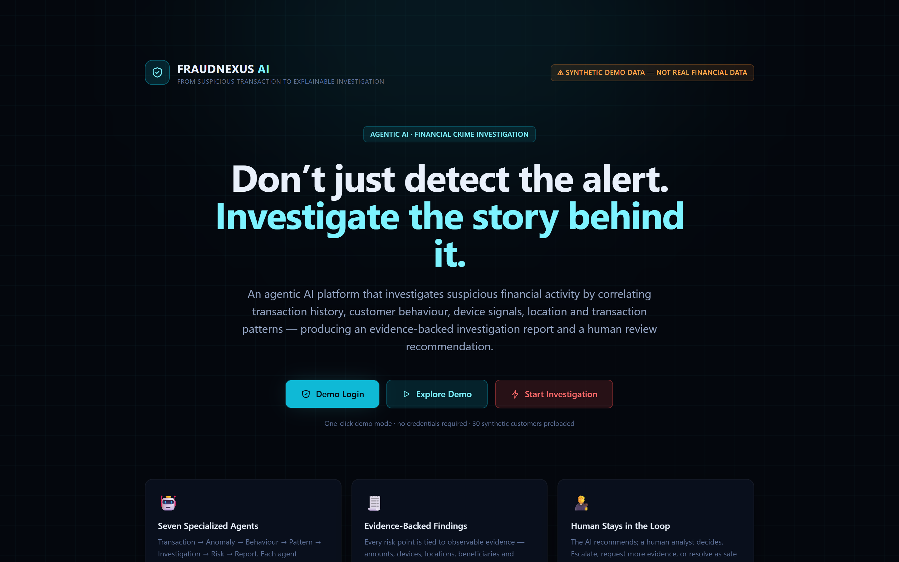
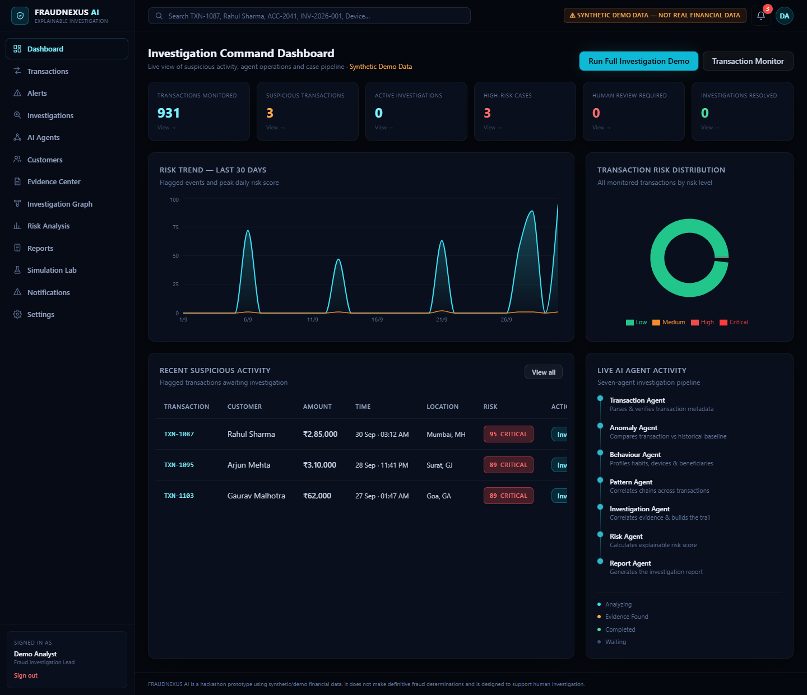
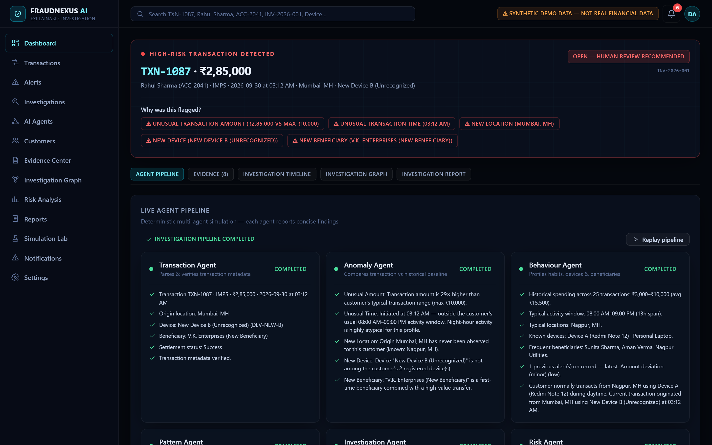
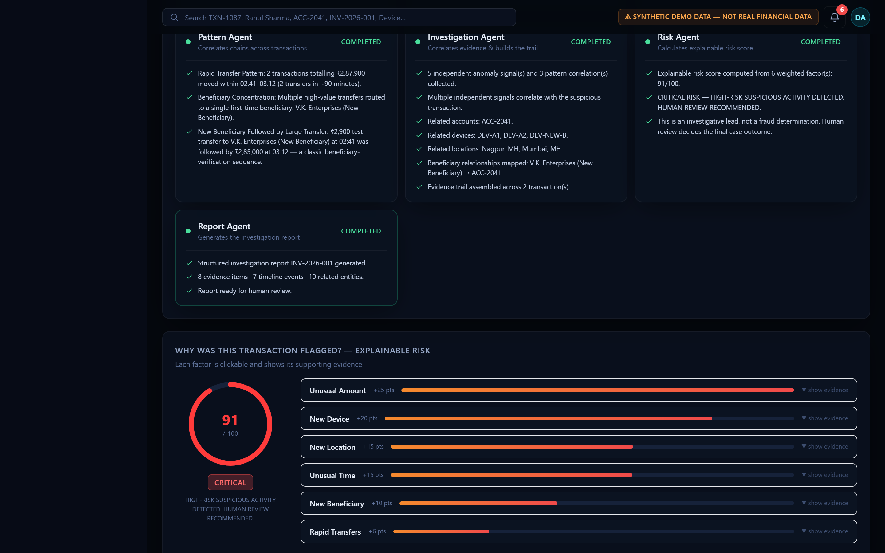
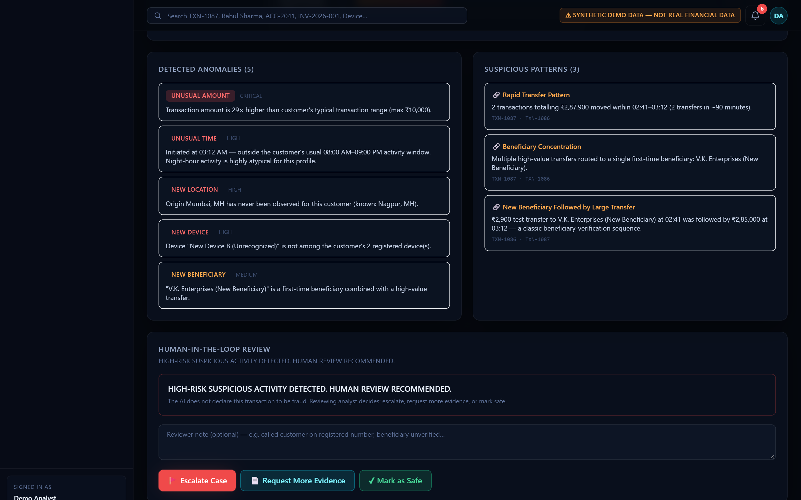
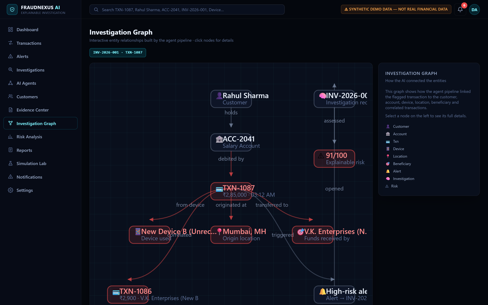
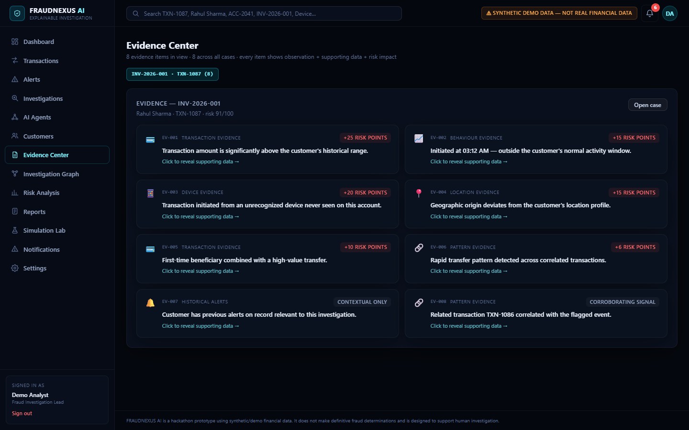
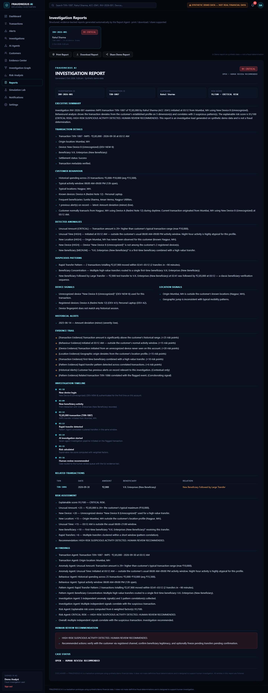
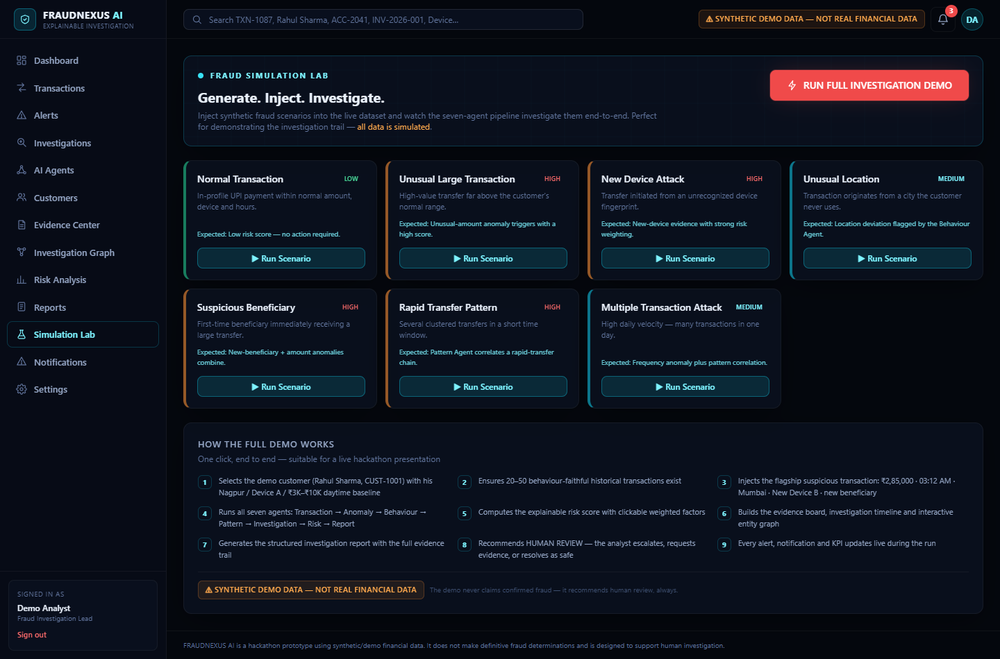
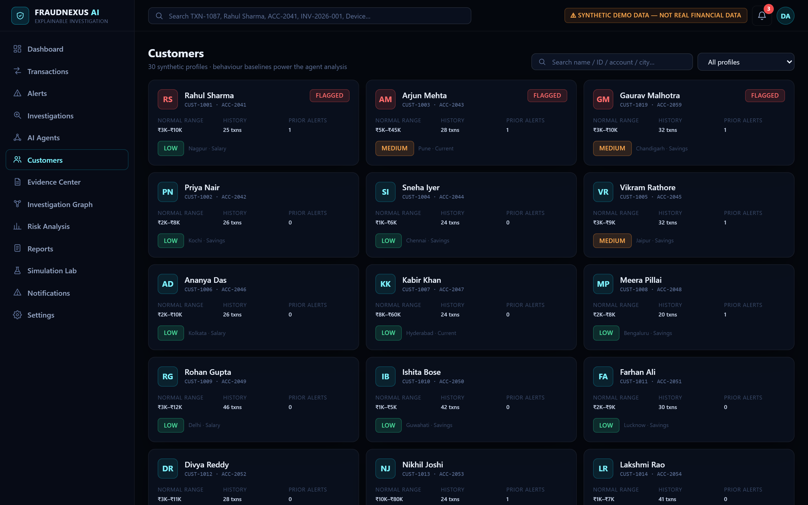

<div align="center">

# 🔍 FRAUDNEXUS AI

### From Suspicious Transaction to Explainable Investigation

**An agentic AI financial-crime investigation workspace — built for hackathon demos.**


</div>

> ⚠️ **DEMO DATA DISCLAIMER** — FRAUDNEXUS AI is a hackathon prototype running entirely on **synthetic data**. Every customer, account, device and transaction is fictional. The AI **never declares fraud** — it recommends **human review**, always. All scoring is a transparent, rule-based simulation, not a real fraud model.

---

## 💡 The Idea

Traditional fraud systems stop at the alert. FRAUDNEXUS AI picks up where they stop:

**Alert → Seven-agent investigation → Explainable risk score → Evidence board → Human decision**

A suspicious transaction is investigated end-to-end by a deterministic pipeline of seven specialized agents that correlate transaction history, customer behaviour, devices, locations and transaction patterns — producing an evidence-backed report with a **human-in-the-loop** recommendation. Every risk point is clickable down to its supporting evidence.

---

## 📸 Screenshots

| Landing | Dashboard |
| --- | --- |
|  |  |

| Agent Pipeline | Explainable Risk (91/100) |
| --- | --- |
|  |  |

| Human-in-the-Loop | Investigation Graph |
| --- | --- |
|  |  |

| Evidence Board | Investigation Report |
| --- | --- |
|  |  |

| Simulation Lab | Customers |
| --- | --- |
|  |  |

---

## 🚀 Quick Start

```bash
npm install
npm run dev          # → http://localhost:3000
```

> Port 3000 busy (Docker etc.)? Run `npx next dev -p 3100` instead.

Click **Demo Login** on the landing page — no credentials, no backend, no external APIs. 30 synthetic customers and ~930 transactions are generated deterministically in-memory on load.

**Regenerating README screenshots** (optional, uses system Chrome/Edge via `puppeteer-core` with the dev server running):

```bash
node scripts/capture.mjs   # writes docs/screenshots/*.png
```

---

## 🎬 90-Second Judge Demo

1. **Landing** → click **Demo Login**.
2. **Dashboard** — live KPIs, 30-day risk trend, risk distribution, recent suspicious activity, live agent panel.
3. Click **Run Full Investigation Demo** (Simulation Lab) — or open the seeded flagship **TXN-1087** directly.
4. Watch the **7-agent pipeline** execute live: Transaction → Anomaly → Behaviour → Pattern → Investigation → Risk → Report.
5. **Explainable risk: 91/100 CRITICAL** — every weighted factor is clickable and shows its evidence.
6. Explore the **Evidence board**, **Timeline**, **Entity graph** and the auto-generated **Report** (print / download / share).
7. Go full circle: **🚩 Escalate Case** (or *Request More Evidence* / *Mark as Safe*) — the analyst decision updates the case status, notifications and KPIs live.

### 🧨 The Flagship Case (seeded, deterministic)

**Rahul Sharma (CUST-1001, Nagpur)** — baseline: ₹3K–₹10K, 08:00–21:00, Device A (Redmi Note 12).

- **TXN-1086** · ₹2,900 · 02:41 AM · Mumbai · New Device B → V.K. Enterprises *(individually looks benign — never alerted)*
- **TXN-1087** · ₹2,85,000 · 03:12 AM · Mumbai · New Device B → V.K. Enterprises *(flagged)*

The Pattern Agent connects them: a classic **test-then-large beneficiary-verification chain** → **91/100 CRITICAL** from 6 explainable factors, 5 anomalies, 3 suspicious patterns, 8 evidence items, 7 timeline events.

---

## 🤖 The Seven-Agent Pipeline

| # | Agent | Role | Contributes |
| --- | --- | --- | --- |
| 1 | **Transaction Agent** | Parses & verifies transaction metadata | Parsed facts, channel, settlement status |
| 2 | **Anomaly Agent** | Compares transaction vs historical baseline | Amount / time / location / device / beneficiary anomalies |
| 3 | **Behaviour Agent** | Profiles habits, devices & beneficiaries | Spending range, activity window, prior alerts |
| 4 | **Pattern Agent** | Correlates chains across transactions | Rapid-transfer clusters, beneficiary concentration, test-then-large |
| 5 | **Investigation Agent** | Correlates evidence & builds the trail | Related entities, evidence set, timeline |
| 6 | **Risk Agent** | Calculates the explainable score | Weighted factors 0–100 + recommendation |
| 7 | **Report Agent** | Generates the investigation report | Structured, printable, shareable report |

## ⚖️ Explainable Risk Model

Shared single-source engine (`src/lib/risk.ts` + pipeline) — the same weights drive badges, workspace and reports:

| Factor | Points |
| --- | --- |
| Unusual amount | +12 … +25 (scales with ratio) |
| New device | +20 |
| New location | +15 |
| Unusual time | +15 |
| New beneficiary | +10 |
| Rapid transfers (pattern) | +6 |
| Historical alerts | +5 |

**Thresholds:** ≥85 **CRITICAL** · ≥60 HIGH → *human review recommended* · ≥25 MEDIUM · else LOW.
The flagship case: 25 + 20 + 15 + 15 + 10 + 6 = **91/100 CRITICAL**.

---

## ✨ Feature Highlights

- 🧠 **7-agent deterministic pipeline** — same input, same findings, every run (seeded RNG, zero LLM calls)
- 🧮 **Explainable risk score** — every point traceable to a clickable evidence card
- 🧾 **Evidence board** — 8 evidence items with source, supporting data and risk impact
- ⏱ **Investigation timeline** — from new-device login to human-review recommendation
- 🕸 **Interactive entity graph** — customer ↔ account ↔ device ↔ location ↔ beneficiary ↔ correlated TXNs
- 🧑‍⚖️ **Human-in-the-loop** — Escalate / Request more evidence / Mark as safe, with reviewer notes + live notifications
- 📄 **Auto-generated reports** — executive summary, full trail, print/download/share
- 🧪 **Simulation Lab** — 8 injectable scenarios (normal → rapid-transfer pattern → full fraud demo)
- 🔎 **Global search** (TXN, customer, account, investigation) · 📊 Risk analytics · 🔔 Notification centre
- 🖥 **Fully responsive** — sidebar collapses on mobile, tables degrade gracefully

## 🧱 Tech Stack

| Layer | Choice |
| --- | --- |
| Framework | Next.js 14 (App Router) + React 18 + TypeScript 5.5 |
| Styling | Tailwind CSS 3.4 (custom dark "cyber-navy" design system) |
| Charts | Recharts 2.12 |
| Data | 100% in-memory synthetic world — deterministic seeded generation, no DB, no APIs |
| Screenshots | puppeteer-core + system Chrome (`scripts/capture.mjs`) |

## 📁 Project Structure

```
src/
├── app/
│   ├── page.tsx                  # Landing
│   └── (app)/                    # Sidebar shell + 13 pages
│       ├── dashboard/  transactions/  alerts/  investigations/
│       ├── agents/  customers/  evidence/  graph/  risk/
│       ├── reports/  lab/  notifications/  settings/
│       └── investigate/[txnId]/  # Flagship investigation workspace
├── components/                   # AppShell, AgentFlow, EvidenceBoard,
│                                 # InvestigationGraph, ReportView, ui, GlobalSearch…
└── lib/
    ├── risk.ts                   # Shared explainable scoring engine
    ├── agents/pipeline.ts        # 7-agent investigation pipeline
    ├── investigations.ts         # Case manager + human actions
    ├── simulation.ts             # Simulation Lab scenarios
    └── data/                     # Customers, transactions, world store
```

---

<div align="center">

**FRAUDNEXUS AI** — the AI recommends; a human decides.

⚠️ Hackathon prototype · synthetic demo data only · not a real fraud model · no fraud determinations

</div>

## 🔗 Connect

- [LinkedIn — Devanshu Raut](https://www.linkedin.com/in/devanshu-raut-632167334/)
